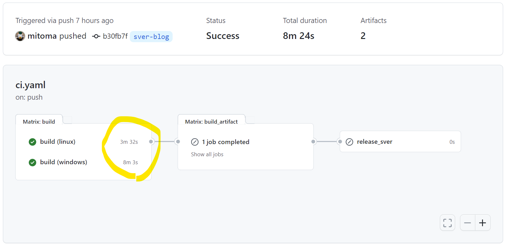
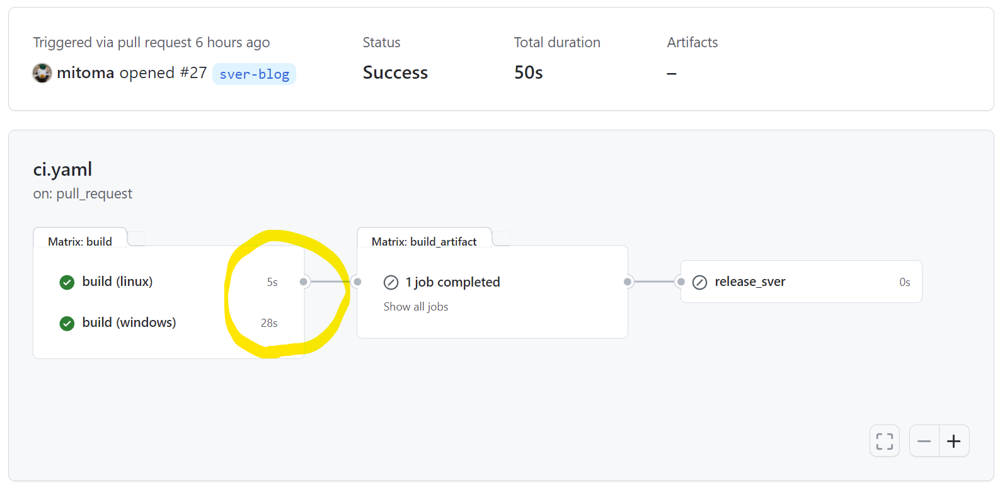

# 同じビルドやテストを何度も実行しない方法

GitHub Actions で同じビルドやテストを何度も実行しない方法を紹介します。  
ホストランナーを ubuntu-linux にした場合、実行する必要のないジョブは 5 秒程度でスキップ可能です。

**注意** このブログは自作の OSS ツール [sver][] および私が現在所属するサイボウス社の [グローバル向けAWS版kintone開発チーム][] の宣伝が含まれます。

## Summary

- ビルドやテストの CI のジョブに再現性がある場合は複数回実行しても意味がない
- ジョブが依存する環境やソースコードを元にハッシュ値を計算することで同等なジョブに一意なラベルをつけられる
- ジョブ実行後に実行済みラベルを artifact として保存しておくことで後続の同等なジョブをスキップできる

## 効果

最初に効果を示します。 [sver][] というプロジェクトのジョブの実行結果です。

これは通常時のジョブの実行時間です。ubuntu-latest で 3 分 32 秒。windows-latest で 8 分 3 秒かかっています。  
毎回ナイーブに実行するには長いジョブだと感じていただけるかと思います。



次はスキップ可能と判定されたジョブの実行時間です。ubuntu-latest で 5 秒。windows-latest で 28 秒かかっています。  
どちらのホストランナーも立ち上げ時間とわずかな判定時間だけでスキップ判定してジョブを終了しています。  
これでも多少の時間はかかってしまいますがナイーブに実行することと比較すると短い時間です。



この仕組みがどのように実現されるか見ていきましょう。

## 同じビルドやテストを何度も実行してしまう

開発時に CI/CD を行うことが一般的になった現代では push や pull req、タグ付けなど様々なイベント毎にビルドやテストを実行します。
また monorepo のように複数のサービスを 1 つのリポジトリにまとめるプラクティスの適用もマイクロサービスの興隆の状況下で増えてきています。

その結果、リポジトリ内のとある変更が CI の結果に影響を及ぼさないことが明らかな場合でも何度もビルドやテストを実行してしまうという状況が発生してしまいます。  
これらはスローテスト問題や計算資源の大量消費という形であらわれ、時間と費用の両面で開発コストを押し上げます。

ビルドやテストが無駄になってしまう例としては、`ある修正を入れて push` → `間違いに気づき revert して push` などがあります。この場合、修正を入れる前に CI が通っていたのならば revert 後に再度 CI を実行する必要はありません。


あるいは、リポジトリ上の README.md やドキュメントを編集したときにビルドやテストなどの CI が走っても無駄なことが多いでしょう。  
事前にジョブの実行が無駄なのが明らかなケースでは `[skip ci]` などのコミットコメントで抑制することもできますが、自明なケースは限られています。

**注釈** 同じソースコードに対して複数回ジョブを流すことが無駄と言えるのはジョブに再現性がある場合です。  
再現性があるとは、同じ入力(ソースコードや環境)であれば何度そのジョブを流しても同じ結果になるという事です。  
外部のライブラリバージョン指定が曖昧であったり、FlakyTest がある場合は再現性に難があると言えるでしょう。

## 同じ入力に対して一意なラベルをつけよう

ジョブに再現性があるという前提の下では、過去のジョブの結果を保存しておけばそのジョブはスキップ可能です。  
ですが、過去のジョブと現在のジョブは同じものかどのように照合すればよいでしょう。

これは、ジョブの入力に対して一意なラベルをつけることで照合可能です。  
ジョブの入力とは、そのジョブで使われるソースコード一式とジョブが実行される環境です。  
GitHub Actions などリポジトリにジョブの定義ファイルを配置するタイプの CI ツールであれば環境もソースコードとみなして扱うことができます。

**注釈** GitHub Actions でホストランナーを `runs-on: ubuntu-latest` など指定した場合に環境が一意と呼べるかについては、求める一意性の厳密さ次第です。

ではジョブの入力に対して一意なラベルをつけるにはどのような方法があるでしょうか。


簡易的にはツリーオブジェクトのハッシュ値を用いる方法があります。`git rev-parse HEAD^{tree}` で計算可能です。  
songmu さんの ["同じソースツリーでテストが通っていたらテストをスキップする"][skip-test-blog] というブログでも git コマンドと S3 を用いる方法が紹介されています。

この方法を用いると、ブランチ違いの同一ジョブ、push・pull-request といったイベント違いの同一ジョブの実行を抑制することができます。

ただし、ジョブの成果物に影響のない変更でもハッシュが変わってしまうため、ドキュメントをリポジトリに入れていたり、monorepo のように多数のサービスが含まれるリポジトリでは `git rev-parse HEAD^{tree}` でも十分ではありません。

`echo <ジョブに使われるファイルのリスト> | xargs -I@ cat "@" | sha256sum` のような処理でハッシュ値を計算することで、リビジョンやブランチに左右されないそのジョブ固有の値が得られます。

しかし `<ジョブに使われるファイルのリスト>` を洗い出してハッシュ値を計算するのは面倒です。  
そちらを簡略化する方法についてはツール[sver][]を後述します。

## 実行結果のラベルを artifact として保存しよう

ラベルを作るためのハッシュ値さえ得られればあとは簡単です。

ジョブが成功したかどうかを表すラベル名を `<ジョブの種別>-<ジョブ固有のハッシュ値>.success` とでも定義します。

そして、ジョブの実行開始時に GitHub Actions の artifact としてラベル名のファイルが存在するかを確認します。そしてファイルがあれば処理をスキップし、無ければ処理を継続して成功すれば artifact としてファイルを保存します。ラベル名に意味があるので、ファイルサイズは 0 でかまいません。

過去の artifact の参照して成否を判定するには gh コマンドを用いるのが簡単でよいでしょう。

```sh
exit_code=0
gh run download -n '<ジョブの種別>-<ジョブ固有のハッシュ値>.success' || exit_code=$?
echo "##[set-output name=exit_code;]${exit_code}"
```

GitHub Actions では artifact の保存期限は最長 90 日なので、それ以上過去に実行されたケースではジョブが再実行されてしまいます。要件的に許容することが難しければ S3 や DynamoDB といった外部のストレージの利用を検討するとよさそうです。

## この方法の良いところ、悪いところ

この方法は、大規模で効率的なビルドをするなら [Bazel][] が良いかもしれない。  
けれど [Bazel][] を採用するには大げさかもしれない。しかしビルドやテストを毎回行いたくない…。  
という要求が発端で生まれました。

やっていることは単にあるファイル群から一意なハッシュ値を計算するだけです。  
この方法を採用する場合は以下のメリット・デメリットがあるでしょう。

**メリット**

- 既存の言語毎のデファクトスタンダードとなるビルドツールをそのまま使い続けられる
- ハッシュ値を何に活用するかは自分たちの要件で決められる

**デメリット**

- ビルドツールで解決されるモジュール間の依存関係を別途管理してやる必要がある
- ハッシュ値計算以外の作りこみはすべて自分たちで検討する必要がある

一般的にビルドツールや CI/CD 周りの仕組みは「そういうのが好きな開発者」以外はあまり手を付けないものです。  
そのような状況下で monorepo 特有の課題を解決するような専門のビルドツールを持ち込むと様々な問題が出てきます。検索しても知見が集まらない、世の中のスタンダードにうまく乗れない、自分たちの要件にうまくマッチしない時に乗り換えにくいなどです。

一方で monorepo のようなリポジトリのジョブをシンプルな道具だけで開発体験を損なわないようにメンテしていくというというのも簡単なものではありません。

この記事が様々な方法を知ったうえでプロダクトの CI/CD 戦略を決める一助になれば幸いです。

**[PR]** 私の所属するサイボウズ社のグローバル向けAWS版kintone開発チームでの事例を元にしています。採用情報は[こちら][グローバル向けAWS版kintone開発チーム]

## ジョブに使うソースコードからハッシュ値を計算するツール

さて、ここからはコードリポジトリのハッシュ値を計算するツールの紹介です。  
このツールを紹介するためにはそのモチベーションを説明しなければならないので前置きが長くなってしまいました。

### git コマンドによる解決の課題

[同じ入力に対して一意なラベルをつけよう](#同じ入力に対して一意なラベルをつけよう) では `<ビルドに使われるファイルのリスト>` からハッシュ値を計算するとよいと書きました。しかし、ファイルのリストを一つ一つ手でメンテナンスするのは現実的ではありません。

例えば以下のような monorepo があるとしましょう。

```sh
.
├── README.md
├── doc
│   ├── Design.md
│   └── Roadmap.md
├── libs
│   ├── lib1
│   └── lib2
└── services
     ├── service1
     └── service2
```

例えば `services/service1` のサービスからハッシュ値を計算するにはどうすればいいでしょう。  
簡単に対応するのであれば以下で済むはずです。

```sh
cd services/service1
git ls-files | xargs -I@ cat "@"  | sha256sum
```

しかし `services/service1` が `libs/lib2` に依存していたらどうでしょう？
`libs/lib2` 以下のファイルも依存に含める必要があります。

また、あるタイミングから `libs/lib2` が `libs/lib1` に依存するようになったらどうでしょう？  
`libs/lib1` 以下のファイルも依存に含める必要がありますが `services/service1` の依存ファイルをメンテするときに漏れずに対応できるでしょうか？


### ハッシュ値計算ツール sver

このようなハッシュ値計算の問題を解決するためのツールが [sver][] です。  
サイボウズ社の [グローバル向けAWS版kintone開発チーム][] の社内ツールをアイデアを元に個人の OSS として開発されています。

[sver][] は小さな rust 製のコマンドラインツールで git リポジトリのファイルのハッシュ値を計算できます。  
「ソースコードから一意なバージョンを作る」という意味を込めて "Source VERsion" → "sver" としています。  
発音は決めてませんが「えすばー」と呼んでます。

例えば、先ほどの `services/service1` のハッシュ値を計算するコマンドは以下のようになります。

```sh
$ sver calc services/service1
ef5d3d3db6d5 # ← 算出されたハッシュ値
```

`services/service1` が別のディレクトリに依存しているときには `sver.toml` という設定ファイルを `services/service1` 以下に配置してやることで推移的にファイルのリストを追加できます。

```toml
[default]
dependencies = [
    "libs/lib2"
]
excludes = []
```

あるタイミングで `libs/lib2` が `libs/lib1` に依存を追加することになったときには `libs/lib2` に以下の `sver.toml` を配置してやるだけで `sver calc service/service1` は推移的に `libs/lib2` と `libs/lib1` のファイルもハッシュ計算に用います。

```toml
[default]
dependencies = [
    "libs/lib1"
]
excludes = []
```

実際にリポジトリ中のどのファイルをハッシュ計算に用いているか確認したくなった時は以下のコマンドでリストすることができます。

```sh
$ sver list services/service1
libs/lib1/xxx.rs
libs/lib1/yyy.rs
libs/lib2/zzz.rs
testdata/service1/main.rs
...
```

他にも以下の機能/特徴があります

- ファイル実行権限、シンボリックリンク、submodule を考慮したハッシュ計算
- 依存ディレクトリ/ファイルの指定、除外ディレクトリ/ファイルの指定
- sver.toml が循環参照が含む場合も解決可能
- リポジトリ内の `sver.toml` に矛盾がないかどうかの検証

このコマンドを用いることでリポジトリ内に複雑な依存関係を持つケースのハッシュ計算が簡単にできます。  
GitHub Actions で sver コマンドをインストールするには [setup_sver/action.yaml][] が、sver を用いて artifacts があるときにはジョブをスキップする処理の作りこみには [exec_sver/action.yaml][] が参考になります。  
実際の適用例は [ci.yaml][] になります。

詳細や現在の開発状況についてはリポジトリ https://github.com/mitoma/sver をご参照ください。

### Altanative

[sver][] や [Bazel][] 以外の monorepo の課題を解決するためのツールについては [monorepo.tools][] や [awesome-monorepo][] などを参照するとよいでしょう。

[sver]: https://github.com/mitoma/sver
[skip-test-blog]: https://songmu.jp/riji/entry/2021-03-08-utilize-git-tree-hash-in-testing.html
[グローバル向けAWS版kintone開発チーム]: https://cybozu.co.jp/recruit/entry/career/aws-kintone.html

[setup_sver/action.yaml]: https://github.com/mitoma/sver/blob/744d02a956c704747fe49b3454879ebbb1c269a2/.github/actions/setup_sver/action.yaml
[exec_sver/action.yaml]: https://github.com/mitoma/sver/blob/744d02a956c704747fe49b3454879ebbb1c269a2/.github/actions/exec_sver/action.yaml
[ci.yaml]:https://github.com/mitoma/sver/blob/744d02a956c704747fe49b3454879ebbb1c269a2/.github/workflows/ci.yaml#L28-L48

[Bazel]: https://bazel.build/
[monorepo.tools]: https://monorepo.tools/
[awesome-monorepo]: https://github.com/korfuri/awesome-monorepo#build-systems--dependency-management-tools
